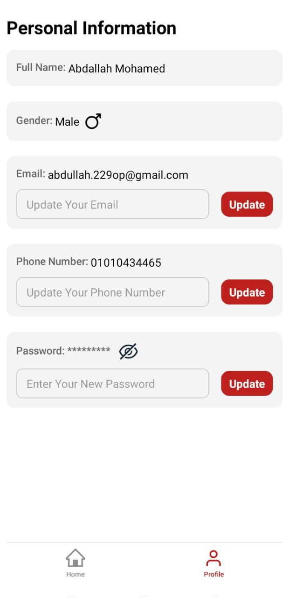

# Screenshots📸

   
Registration Screens

   
   
   
    
   

   
   
Home Screen

   
   
    
   

   
   
Profile Screen

   

## Tech Stack:
- react-native @0.81.4
- expo @54.0.6
- reduxjs/toolkit @2.9.0
- react-native-vector-icons @15.0.2
